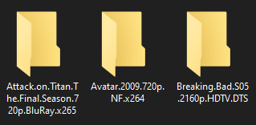
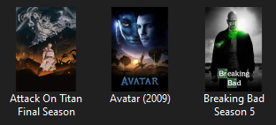

# LibraryFace

**LibraryFace** is a smart desktop tool that transforms plain media folders into a beautifully organized library.  
It automatically sets custom folder icons and posters for anime, movies, and TV shows using a large dataset.

---

## ✨ Features

- 🔍 **Metadata Recognition**: Detect titles, seasons, parts, and more from messy folder names.
- 🖼 **Poster Fetching**: Automatically grab high-quality posters that matches the foler name.
- 🎨 **Folder Icon Generation**: Turn any folder into a visually recognizable media tile.
- 🧠 **Intelligent Title Normalization**: Clean and format folder names.
- 🧰 **Undo & Restore Tools**: You are in charge, roll back any icon or poster change with one click.

---

### 📋 Requirements

- Windows OS (tested on Windows 10/11)
- Internet connection for poster download

---

### 📁 How to Use

1. Download the `.exe` from this release.
2. Run the app.
3. Browse to your folder(s) containing anime, movies, or shows.
4. Click “Start” — and enjoy the transformation.
5. Use the “Undo” tab to reverse any change if needed.

---

## 🔄 Before & After Example

| Before Iconify | After Iconify |
|----------------|----------------|
|  |  |

> _“Let your folders speak for themselves.”_

---

### 💬 Feedback

Have suggestions, bugs, or feature ideas?  
Open an issue or contact me directly at **mohamedwy6@gmail.com**